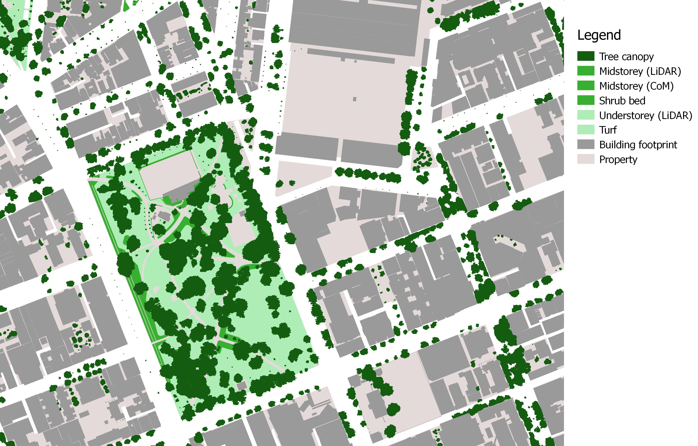

# urbanConnect
Reproducible workflow in R for measuring **ecological connectivity** in urban areas. 

Here you will find a collection of R scripts, functions and tutorials for calculating an ecological connectivity index based on the City Biodiversity Index Indicator #2, [(Deslauriers et al. 2017)](https://www.sciencedirect.com/science/article/pii/S1470160X17300912).

